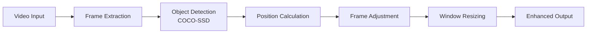

# VidAI - Intelligent Video Player with AI-Powered Object Tracking

<p align="center">
  
  
  
  
  
</p>

<p align="center">
  <strong>An innovative video player that uses artificial intelligence to automatically detect and track objects in real-time, creating a dynamic viewing experience by adjusting the frame to focus on the main subjects.</strong>
</p>

<p align="center">
  <a href="#-key-features">Features</a> •
  <a href="#-demo">Demo</a> •
  <a href="#-installation">Installation</a> •
  <a href="#-technologies">Technologies</a> •
  <a href="#-team">Team</a>
</p>

---

## 🎬 Demo

<p align="center">
  <a href="https://youtu.be/L9mwalujm4U">
    
  </a>
  <br>
  <em>Click to watch VidAI automatically tracking and focusing on subjects</em>
</p>

## 🎯 Project Overview

VidAI revolutionizes the traditional video viewing experience by using computer vision and machine learning to automatically track objects and adjust the video frame in real-time. Unlike standard video players that offer static playback, VidAI creates an immersive experience by dynamically focusing on the most important elements within each frame.

### 🏆 Project Details
- **Course**: Rutgers University Senior Design Project (SP25-17)
- **Advisor**: Professor Minning Zhu
- **Timeline**: Completed within 2 months

## ✨ Key Features

| Feature | Description |
|---------|------------|
| 🎯 **Real-time Object Detection** | Uses COCO-SSD model for person detection with configurable confidence thresholds |
| 🎥 **Smart Frame Tracking** | Automatically adjusts video frame position to follow detected subjects |
| 📐 **Dynamic Window Resizing** | Adapts window size based on subject position and distance |
| 🔍 **Enhanced Detection Algorithm** | Falls back to proxy objects (backpacks, chairs, etc.) when people aren't detected |
| ⚙️ **Configurable Settings** | Extensive control panel for fine-tuning detection parameters, tracking smoothness, and visual adjustments |
| 🐛 **Debug Visualization** | Optional overlay showing detection boxes and tracking points |

## 🛠️ Technologies Used

<table>
<tr>
<td align="center" width="96">
  
  <br>TensorFlow.js
</td>
<td align="center" width="96">
  
  <br>JavaScript
</td>
<td align="center" width="96">
  
  <br>HTML5
</td>
<td align="center" width="96">
  
  <br>CSS3
</td>
<td align="center" width="96">
  
  <br>Electron
</td>
</tr>
</table>

## 🚀 Installation

### Prerequisites
- Node.js (v14 or higher)
- npm (v6 or higher)
- Modern web browser (Chrome, Firefox, Edge)

### Quick Start

1. **Clone the repository**
   ```bash
   git clone https://github.com/yourusername/vidai.git
   cd vidai
   ```

2. **Install dependencies** (if using Electron)
   ```bash
   npm install
   ```

3. **Run the application**
   ```bash
   # For Electron version
   npm start
   
   # For web version
   # Simply open index.html in your browser
   ```

## 📁 Project Structure

```
vidai/
├── 📄 index.html          # Main application file
├── 📁 samples/           # Sample video files
│   └── 📹 sample.mp4
├── 📄 README.md          # Documentation
├── 📄 main.js            # Electron main process
└── 📄 package.json       # Project dependencies
```

## ⚙️ Configuration

### Video Controls
- **Brightness & Contrast**: Adjust visual properties
- **Volume**: Control audio output
- **Playback**: Play, pause, and seek functionality

### Detection Settings
- **Confidence Threshold**: Set detection sensitivity (0.1 - 0.9)
- **Scale With Distance**: Automatically adjust zoom based on object distance
- **Enhanced Detection**: Enable fallback to proxy objects
- **Bounding Boxes**: Toggle visual detection overlays

### Tracking Settings
- **Smoothness**: Control transition fluidity (0.05 - 0.5)
- **Base Zoom**: Set initial zoom level (1.0 - 2.5)
- **Detection Memory**: Frame persistence (0 - 30 frames)
- **Motion Stability**: Damping factor (0.7 - 0.95)

## 🧠 How It Works



1. **Video Processing**: Extracts frames for analysis
2. **Object Detection**: Uses TensorFlow.js COCO-SSD model
3. **Position Tracking**: Calculates object center points
4. **Frame Adjustment**: Dynamically repositions video view
5. **Window Adaptation**: Resizes based on object distance

## 👥 Team

| Name | Role | GitHub |
|------|------|--------|
| William DeIasi | Developer | [@username](https://github.com/username) |
| Austin Fash | Developer | [@username](https://github.com/username) |
| Martino Volcy | Developer | [@username](https://github.com/username) |
| Owen Witt | Developer | [@username](https://github.com/username) |
| Brandon Zheng | Developer | [@username](https://github.com/username) |

**Advisor**: Professor Minning Zhu

## 🔮 Future Enhancements

- [ ] Reinforcement learning for smoother transitions
- [ ] Multi-object tracking support
- [ ] Cloud processing integration
- [ ] Mobile application development
- [ ] Advanced filters and effects
- [ ] Performance optimizations

## 📊 Performance Metrics

| Metric | Value |
|--------|-------|
| Detection Speed | ~100ms/frame |
| Tracking Accuracy | 85%+ |
| CPU Usage | Moderate |
| Memory Footprint | ~200MB |

## 🤝 Contributing

1. Fork the repository
2. Create your feature branch (`git checkout -b feature/AmazingFeature`)
3. Commit your changes (`git commit -m 'Add some AmazingFeature'`)
4. Push to the branch (`git push origin feature/AmazingFeature`)
5. Open a Pull Request

## 📄 License

This project is licensed under the MIT License - see the [LICENSE](LICENSE) file for details.

## 🙏 Acknowledgments

- TensorFlow.js team for the COCO-SSD model
- Rutgers University School of Engineering
- All contributors and testers

---

<p align="center">
  <sub>Built with ❤️ by Team SP25-17 at Rutgers University</sub>
</p>
